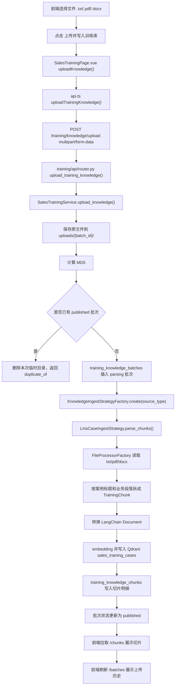
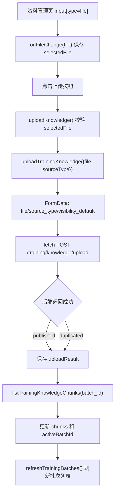
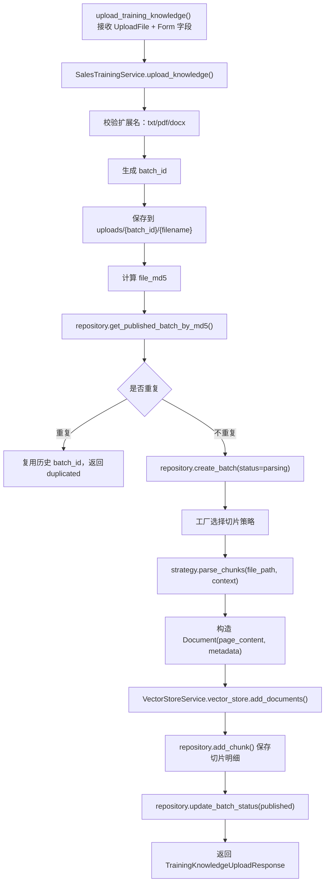
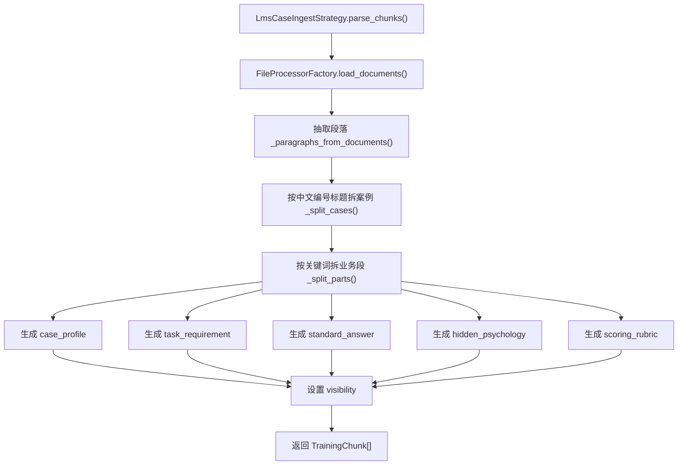
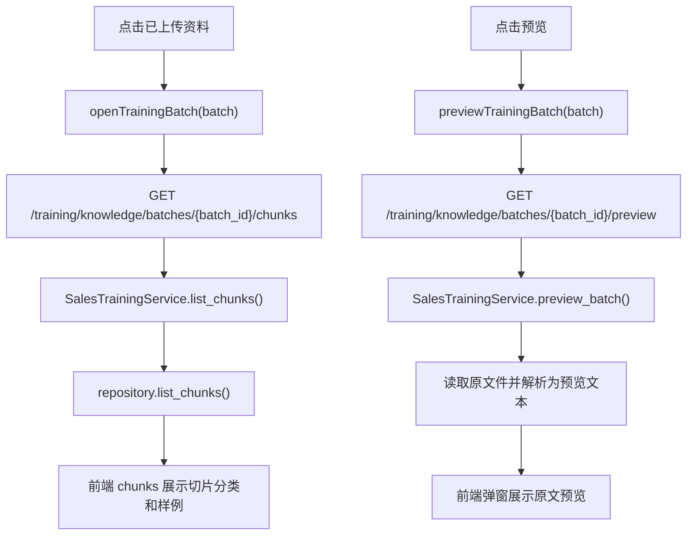
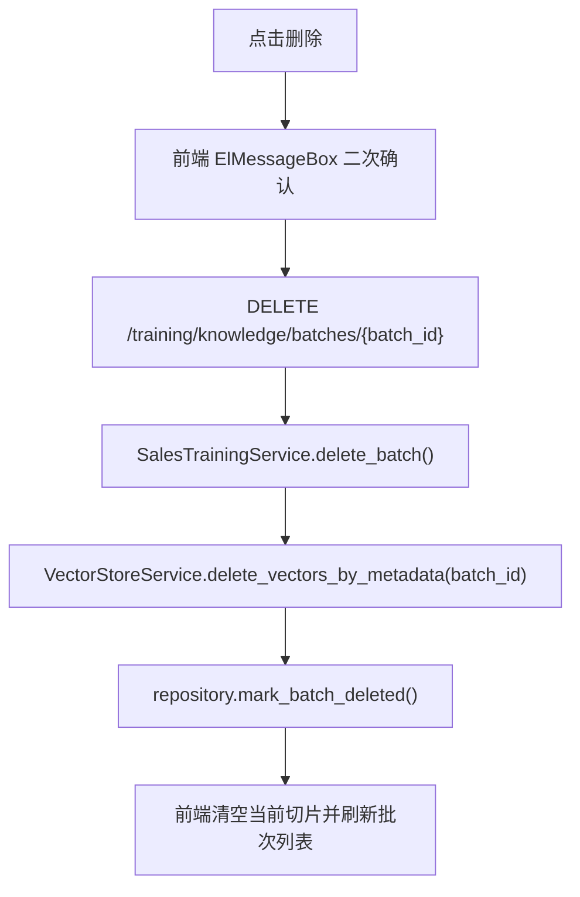

# 销售训练资料管理上传文件流程

本文只梳理销售训练页“资料管理”的上传、预览、切片查看和删除流程，方便按流程图定位代码。

销售训练资料使用独立接口和独立向量库：

| 项目 | 内容 |
| --- | --- |
| 前端页面 | `C:\Users\Administrator\WebstormProjects\AI_RAG_Agent_Frontend\src\pages\SalesTrainingPage.vue` |
| 前端 API | `C:\Users\Administrator\WebstormProjects\AI_RAG_Agent_Frontend\src\api.ts` |
| 后端路由 | `D:\d\PycharmProjects\AI_RAG_Agent_Project\training\api\router.py` |
| 后端服务 | `D:\d\PycharmProjects\AI_RAG_Agent_Project\training\services\sales_training_service.py` |
| 切片策略 | `D:\d\PycharmProjects\AI_RAG_Agent_Project\training\strategies\knowledge_ingest_strategy.py` |
| 策略工厂 | `D:\d\PycharmProjects\AI_RAG_Agent_Project\training\factories\knowledge_ingest_strategy_factory.py` |
| SQLite 仓储 | `D:\d\PycharmProjects\AI_RAG_Agent_Project\training\repository.py` |
| Qdrant collection | `sales_training_cases` |

## 1. 总流程图

## 2. 前端上传流程

### 前端代码定位

| 流程节点 | 代码位置 | 说明 |
| --- | --- | --- |
| 文件选择 | `SalesTrainingPage.vue` 模板中的 `input ref="uploadFileInput"` | 限制 `.docx,.pdf,.txt`，选择后进入 `onFileChange()` |
| 保存选中文件 | `SalesTrainingPage.vue::onFileChange()` | 将浏览器 `File` 保存到 `selectedFile` |
| 上传按钮 | `SalesTrainingPage.vue` 模板中的 `@click="uploadKnowledge"` | 用户点击后进入上传主流程 |
| 前端上传主流程 | `SalesTrainingPage.vue::uploadKnowledge()` | 校验文件、调用 API、刷新切片和批次列表 |
| 组装上传请求 | `api.ts::uploadTrainingKnowledge()` | 使用 `FormData` 发 `multipart/form-data` |
| 查询切片 | `api.ts::listTrainingKnowledgeChunks()` | 上传成功后按 `batch_id` 拉取切片 |
| 查询批次 | `api.ts::listTrainingKnowledgeBatches()` | 刷新已上传资料列表 |
| 原文预览 | `api.ts::previewTrainingKnowledgeBatch()` | 读取服务端保存的原文件文本 |
| 删除资料 | `api.ts::deleteTrainingKnowledgeBatch()` | 删除 Qdrant 向量并软删除 SQLite 批次 |

## 3. 后端上传入库流程

### 后端代码定位

| 流程节点 | 代码位置 | 说明 |
| --- | --- | --- |
| 路由入口 | `training/api/router.py::upload_training_knowledge()` | 接收 `file` 和 `source_type` 等表单字段 |
| 上传主流程 | `training/services/sales_training_service.py::upload_knowledge()` | 文件保存、去重、切片、写 Qdrant、写 SQLite |
| 文件名清洗 | `SalesTrainingService._safe_filename()` | 防止路径穿越，保证空文件名有兜底名称 |
| 批次落库 | `training/repository.py::create_batch()` | 插入 `training_knowledge_batches` |
| MD5 去重 | `training/repository.py::get_published_batch_by_md5()` | 只复用 `status='published'` 的批次 |
| 策略选择 | `training/factories/knowledge_ingest_strategy_factory.py::create()` | `lms_case` 使用 LMS 策略，其他走通用策略 |
| LMS 切片 | `training/strategies/knowledge_ingest_strategy.py::LmsCaseIngestStrategy.parse_chunks()` | 按案例和业务段落拆分 |
| 通用切片 | `GenericTrainingIngestStrategy.parse_chunks()` | 未知来源类型整篇兜底为一个切片 |
| 写 Qdrant | `SalesTrainingService.upload_knowledge()` 中 `vector_store.add_documents()` | 写入 `sales_training_cases` |
| 写切片明细 | `training/repository.py::add_chunk()` | 插入 `training_knowledge_chunks` |
| 更新状态 | `training/repository.py::update_batch_status()` | 成功为 `published`，失败为 `parsing_failed` |

## 4. LMS 案例切片流程

### 切片类型

| `case_part` | 中文含义 | visibility | 主要用途 |
| --- | --- | --- | --- |
| `case_profile` | 客户背景/案例信息 | `visible` | 生成 AI 客户背景 |
| `task_requirement` | 训练任务要求 | `visible` | 生成训练阶段和目标 |
| `standard_answer` | 标准话术/参考答案 | `visible` | 对话建议和评分参考 |
| `hidden_psychology` | 客户隐性心理/底层顾虑 | `hidden` | AI 客户追问和异议 |
| `scoring_rubric` | 命中点/扣分点/评分标准 | `scoring_only` | 训练结束评分 |

如果 LMS 文档没有识别出结构，策略会兜底生成一个 `case_profile` 切片。能入库，但训练效果会弱，应该检查源文件标题和段落结构。

## 5. 入库后保存了什么

### SQLite: `training_knowledge_batches`

保存文件级信息：

| 字段 | 中文含义 |
| --- | --- |
| `batch_id` | 上传批次编号 |
| `source_type` | 来源类型，一期默认 `lms_case` |
| `source_file` | 原始文件名 |
| `file_path` | 服务端保存路径 |
| `file_md5` | 文件 MD5 |
| `status` | `parsing` / `published` / `parsing_failed` / `deleted` |
| `chunk_count` | 切片数量 |
| `point_count` | Qdrant 向量点数量 |
| `error_message` | 失败原因 |

### SQLite: `training_knowledge_chunks`

保存切片级信息：

| 字段 | 中文含义 |
| --- | --- |
| `chunk_id` | 切片编号 |
| `batch_id` | 所属批次 |
| `qdrant_point_id` | Qdrant 点编号，一期等于 `chunk_id` |
| `chunk_text` | 切片正文 |
| `case_part` | 业务片段类型 |
| `visibility` | 模型使用范围 |
| `metadata_json` | `case_title`、`case_index`、`source_file` 等 |

### Qdrant: `sales_training_cases`

保存向量和 payload。payload 关键字段：

| 字段 | 中文含义 |
| --- | --- |
| `batch_id` | 上传批次编号 |
| `chunk_id` | 切片编号 |
| `content_type` | 固定 `sales_training_case` |
| `source_type` | 来源类型 |
| `source_file` | 来源文件 |
| `file_md5` | 文件 MD5 |
| `case_part` | 业务片段类型 |
| `visibility` | 模型使用范围 |
| `case_title` | LMS 案例标题 |
| `case_index` | LMS 案例序号 |

## 6. 预览和切片查看流程

预览接口不会重新写入向量库。它只是读取 `training_knowledge_batches.file_path` 指向的原文件，用对应策略解析出文本。

## 7. 删除流程

删除行为：

| 层级 | 动作 |
| --- | --- |
| Qdrant | 按 `metadata.batch_id` 删除向量点 |
| SQLite | `training_knowledge_batches.status` 标记为 `deleted` |
| 原文件 | 暂时保留在 `uploads/{batch_id}/`，方便审计和排查 |

## 8. 排查顺序

| 现象 | 优先看哪里 |
| --- | --- |
| 前端点上传没反应 | `SalesTrainingPage.vue::uploadKnowledge()` 和浏览器控制台 |
| 请求 400 文件类型不支持 | `SalesTrainingService.upload_knowledge()` 的扩展名校验 |
| 返回 duplicated | `training_knowledge_batches.file_md5` 已有 published 批次 |
| chunk_count 为 0 | `LmsCaseIngestStrategy.parse_chunks()` 和源文件结构 |
| 上传很慢 | `vector_store.add_documents()`，通常是 embedding 或 Qdrant 写入耗时 |
| 切片类型不对 | `PART_MARKERS` 关键词是否覆盖源文件标题 |
| 生成 AI 客户没引用资料 | 检查 Qdrant `sales_training_cases` 是否有点，以及 metadata 的 `visibility/case_part` |
| 删除后仍被召回 | 检查 `delete_vectors_by_metadata("batch_id", batch_id)` 是否成功 |
